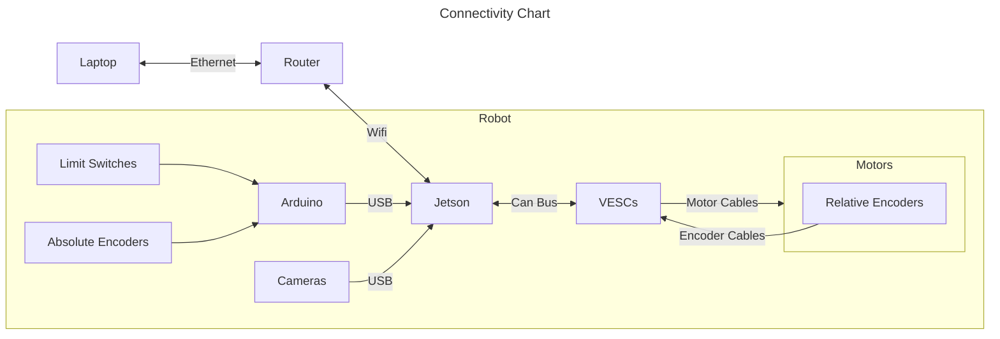
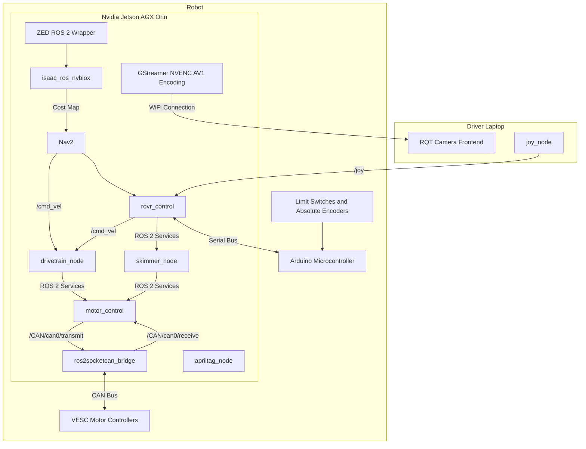
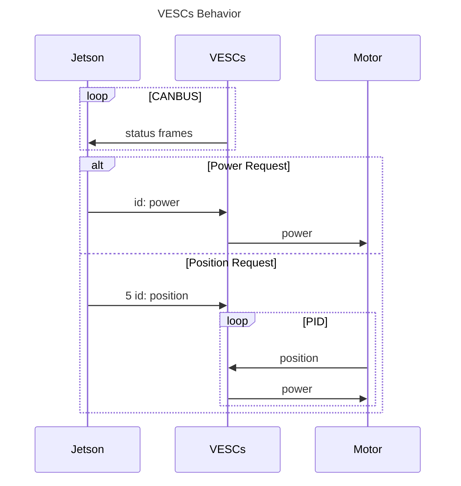

# Lunabotics

The official NASA Lunabotics GitHub repository for University of Minnesota Robotics.

[](https://github.com/GOFIRST-Robotics/Lunabotics/actions/workflows/linter_check.yml) [](https://github.com/GOFIRST-Robotics/Lunabotics/actions/workflows/trufflehog_scan.yml)









## How to Run Inside Docker Container

<details>
<summary>How to Run Inside the Dev Container On Windows/Mac</summary>
<br>
Open vscode then press ctrl+shift+p and type "Clone Repository in Container Volume". Select "Dev Containers: Clone Repository in Container Volume" and then select "Clone a repository from GitHub in a Container Volume". Search for and select our Lunabotics repository.
<br><br>

If your machine does not have an Nvidia GPU or you haven't set it up with [container-toolkit](https://docs.nvidia.com/datacenter/cloud-native/container-toolkit/latest/install-guide.html), run the following commands in the Command Palette (Ctrl + Shift + P):

```
Tasks: Configure Default Build Task
Build No GPU Tasks
```

After opening the container, run the following commands in the Command Palette (Ctrl + Shift + P):
```
Tasks: Run Build Task
```
</details>
<details>
<summary>Updating Dev Container For Windows/Mac</summary>
<br>
If you ever need to rebuild the remote container image, first update the x86_64 and aarch64 images:

```
cd ~/Lunabotics/src/isaac_ros/isaac_ros_common/docker

docker build --build-arg="BASE_IMAGE=nvcr.io/nvidia/isaac/ros:x86_64-ros2_humble_bcf535ea3b9d16a854aaeb1701ab5a86" -f Dockerfile.user -t umnrobotics/isaac_ros:x86_64.ros2_humble.user .
docker build --build-arg="BASE_IMAGE=umnrobotics/isaac_ros:x86_64.ros2_humble.user" -f Dockerfile.umn -t umnrobotics/isaac_ros:x86_64.ros2_humble.user.umn .
docker push umnrobotics/isaac_ros:x86_64.ros2_humble.user.umn

docker build --build-arg="BASE_IMAGE=nvcr.io/nvidia/isaac/ros:aarch64-ros2_humble_b7e1ed6c02a6fa3c1c7392479291c035" -f Dockerfile.user -t umnrobotics/isaac_ros:arm64.ros2_humble.user --platform "arm64" .
docker build --build-arg="BASE_IMAGE=umnrobotics/isaac_ros:arm64.ros2_humble.user" -f Dockerfile.umn -t umnrobotics/isaac_ros:arm64.ros2_humble.user.umn --platform "arm64" .
docker push umnrobotics/isaac_ros:arm64.ros2_humble.user.umn
```

Then, run the following command with the devcontainer cli installed:
```
docker pull umnrobotics/isaac_ros:x86_64.ros2_humble.user.umn
docker pull umnrobotics/isaac_ros:arm64.ros2_humble.user.umn --platform "arm64"

docker manifest rm umnrobotics/isaac_ros:latest
docker manifest create umnrobotics/isaac_ros:latest --amend umnrobotics/isaac_ros:arm64.ros2_humble.user.umn --amend umnrobotics/isaac_ros:x86_64.ros2_humble.user.umn
docker manifest push umnrobotics/isaac_ros:latest

docker buildx create --use
devcontainer build --push true --workspace-folder . --platform="linux/amd64,linux/arm64" --image-name "umnrobotics/ros:isaac_ros_devcontainer"
```
</details>

<details>
<summary>How to Run Inside ISAAC ROS Container/Dev Container On Linux/Jetson</summary>
<br>
First, do the following before running run_dev.sh:

```
printf "CONFIG_IMAGE_KEY=ros2_humble.realsense.deepstream.user.zed.umn \n" > ~/Lunabotics/src/isaac_ros/isaac_ros_common/scripts/.isaac_ros_common-config 
``` 
To use Gazebo in the ISAAC ROS container, do this instead:

```
printf "CONFIG_IMAGE_KEY=ros2_humble.realsense.deepstream.user.zed.umn.gazebo \n" > ~/Lunabotics/src/isaac_ros/isaac_ros_common/scripts/.isaac_ros_common-config 
``` 
<details>
<summary>Regular Container</summary>
<br>
To make it so zed modules won't rerun every time you start the container, do this:

```
echo "-v /usr/local/zed/resources:/usr/local/zed/resources -v /ssd:/ssd" > ~/Lunabotics/src/isaac_ros/isaac_ros_common/scripts/.isaac_ros_dev-dockerargs
```
Then run this command:

```
cd ~/Lunabotics/src/isaac_ros/isaac_ros_common/docker
../scripts/run_dev.sh ~/Lunabotics
```
</details>
<details>
<summary>Dev Container</summary>
<br>
First run this command to build the container:

```
../scripts/build_devcontainer_image.sh
```

Then use Command Palette (Ctrl + Shift + P) to open devcontainer
```
>Dev Containers: Reopen in Container
```

</details>
It is also worth noting that the docker buildkit doesn't respect Nvidia runtime for building which is needed for zed, so if you set up a new jetson you will need to do one of the following (https://github.com/NVIDIA-ISAAC-ROS/isaac_ros_common/issues/98#issuecomment-1777711989)
</details>

## ROS 2 General Workspace Tips

Make sure to `source install/setup.bash` in every new terminal.

Run `rosdep install -i --from-path src --rosdistro $ROS_DISTRO -y --skip-keys "nvblox negotiated"` to install package dependencies.

Run `rm -rf build install log` to clean your workspace.

To normalize line endings in git, use the command:
```
git config --global core.autocrlf true
```

## Gazebo Simulation

<details>
<summary>Gazebo Installation & Resources</summary>
<br>
  
Install Gazebo Fortress by running: `sudo apt-get install ros-humble-ros-gz`

More info [here](https://gazebosim.org/docs/garden/ros_installation). Remember that we are using ROS 2 Humble.

Instructions for building the ROS bridge (ros_gz) can be found [here](https://github.com/gazebosim/ros_gz/tree/humble#from-source).

Information about ROS types -> gazebo types can be found [here](https://github.com/gazebosim/ros_gz/blob/ros2/ros_gz_bridge/README.md)
</details>

<details>
<summary>Running the Gazebo Simulation</summary>
<br>
  
To run the Gazebo simulation:
```
colcon build --symlink-install --packages-up-to ros_gz_launch
source install/setup.bash
ros2 launch ros_gz_launch UCF_field.launch.py
```

Then to control the robot, you will need to run:
```
ros2 run teleop_twist_keyboard teleop_twist_keyboard
```
in another terminal to control the robot with your keyboard.

Alternatively, you can run these nodes:
```
ros2 run joy joy_node
ros2 run rovr_control main_control_node
```
to control the robot using a gamepad and our button bindings assigned in the main_control_node.
</details>

## Start the Joystick Node with params

```
ros2 run joy joy_node --ros-args --params-file config/joy_node.yaml
```

## Apriltag Detection Setup

Follow [this](https://github.com/NVIDIA-ISAAC-ROS/isaac_ros_apriltag/blob/main/docs/tutorial-usb-cam.md) tutorial to set up Apriltag detection on your machine.

## VESC CAN Bus References

[VESC CAN Status Frames Spreadsheet](https://github.com/codermonkey42/VESC_CAN)

[VESC 6 CAN Formats](https://vesc-project.com/sites/default/files/imce/u15301/VESC6_CAN_CommandsTelemetry.pdf)

[VESC Control with CAN](https://dongilc.gitbook.io/openrobot-inc/tutorials/control-with-can)

<details>
<summary>How to load the CAN modules at startup on Nvidia Jetson</summary>
<br>
1: Put the following in a .conf file in /modules-load.d/

```
#Setting up the CAN bus 
can
can_raw
mttcan
#eof
```

2: Find the file /etc/modprobe.d/denylist-mttcan.conf and either delete it or comment out the one line in it (The filename might be .../blacklist-mttcan.conf)

3: Make a script called "can_startup.sh" in the root directory for the system, with the following contents:
```
#! /usr/bin/sh

sudo ip link set can0 up type can bitrate 500000
sudo ip link set can1 up type can bitrate 500000
```

4: Run the command "sudo crontab -e" and put this line in the file that appears:

```
@reboot sleep 5 && echo 'robot' | sudo -S sh /
can_startup.sh 2>&1 | logger -t mycmd
```

And that should work. If it doesn't and you need to read the output of the crontab, use this command:

```
sudo grep 'mycmd' /var/log/syslog
```
</details>

## GStreamer References

[Accelerated GStreamer Guide](https://docs.nvidia.com/jetson/archives/r35.2.1/DeveloperGuide/text/SD/Multimedia/AcceleratedGstreamer.html)

<details>
<summary>Gstreamer Server/Client Instructions</summary>
<br>
To start gstreamer client make sure to add the deepstream layer to the docker layers 

To start the gstreamer client run the following commands:

```bash
colcon build --symlink-install --packages-up-to gstreamer
source install/setup.bash
rqt --force-discover
```

To start the gstreamer server run the following commands:

```bash
colcon build --symlink-install --packages-up-to gstreamer
source install/setup.bash
ros2 run gstreamer server_node
```
</details>

## Set static serial ports on the Jetson

Follow [these](https://msadowski.github.io/linux-static-port/) instructions.

## Jetson External HDD Commands

```
sudo service docker stop
sudo mv /var/lib/docker /hd/docker
sudo ln -s /hd/docker /var/lib/docker # Create a symbolic link
sudo service docker start
```
